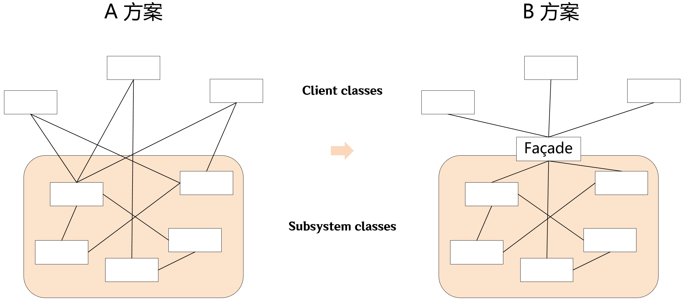

[上一篇](../Flyweight%20Pattern/README.md)

---

# 💠 "接口隔离"模式

在组件构建过程中，某些接口之间直接的依赖常常会带来很多问题，甚至根本无法实现。采用添加一层**间接**（稳定）接口，来隔离本来互相紧密关联的接口是一种常见的解决方案。

典型模式：
* 外观模式 Facade
* 代理模式 Proxy
* 适配器模式 Adapter
* 中介者模式 Mediator

# 外观模式 Facade / Façade

> 外观模式也称为“**门面模式**”，其英文拼写通常是 "Facade"，但是也接受 "Façade" 法语词汇。

## 1、动机



* 上图 A 方案的问题在于组件的客户和组件中各种复杂的子系统有了过多的耦合，随着外部客户程序和各子系统的演化，这种过多的耦合面临很多变化的挑战。
* 如何简化外部客户程序和系统间的交互接口？如何将外部客户程序的演化和内部子系统的变化之间的依赖相互解耦？

> 外观模式隐藏系统的复杂性，并向客户端提供了一个客户端可以访问系统的接口。这种类型的设计模式属于结构型模式，它向现有的系统添加一个接口，来隐藏系统的复杂性。

## 2、介绍

<dl>
    <dt>意图</dt>
    <dd>为子系统中的一组接口提供一个一致的界面，外观模式定义了一个高层接口，这个接口使得这一子系统更加容易使用。</dd>
    <dt>关键代码</dt>
    <dd>在客户端和复杂系统之间再加一层，这一层将调用顺序、依赖关系等处理好。</dd>
</dl>

---

## 3、实现

> 💬 外观模式并没有特定的代码结构，甚至两段结构看起来千差万别的代码可能都表达的外观模式。只要它们都体现了将子系统内部和外部解耦的思想。

### 步骤一

首先我们创建一个接口 Shape：

```cpp
class Shape {
public:
	virtual void render() = 0;
	virtual ~Shape() {};
};
```

### 步骤二

接下来我们创建实现了 Shape 类的实体类 Rectangle 和 Ellipse，它们将重写抽象类的方法以渲染自身。

在外观模式中，Shape、Rectangle 和 Ellipse 将扮演子系统的类（***Subsystem classes***）的角色：

```cpp
class Rectangle :
    public Shape
{
public:
    inline virtual void render() override {
        std::cout << "Inside Rectangle::render() method." << std::endl;
    }
};
```

```cpp
class Ellipse :
    public Shape
{
public:
    inline virtual void render() override {
        std::cout << "Inside Ellipse::render() method." << std::endl;
    }
};
```

### 步骤三

接下来我们将创建外观（***Facade***）类 ShapeMaker。ShapeMaker 为[步骤二](#步骤二)中的子系统提供了一个高层接口以供外部客户端访问子系统。这个接口使得这一子系统更加容易使用。

我们的 ShapeMaker 类如下：

```cpp
class ShapeMaker
{

private:
	Shape* rectangle;
	Shape* ellipse;

public:
	inline ShapeMaker() {
		rectangle = new Rectangle();
		ellipse = new Ellipse();
	}

	void renderRectangle() {
		rectangle->render();
	}
	void renderEllipse() {
		ellipse->render();
	}
	inline ~ShapeMaker() {
		delete rectangle;
		delete ellipse;
	}
};
```

### 步骤四

`main()` 函数将扮演外部客户端的角色，其使用 ShapeMaker 提供的高层接口以访问子系统，最终渲染出各种类型的形状：

```cpp
int main() {
	ShapeMaker shapeMaker;

	shapeMaker.renderRectangle();
	shapeMaker.renderEllipse();
}
```

### 步骤五

执行程序，输出结果：

```plain
Inside Rectangle::render() method.
Inside Ellipse::render() method.
```

---

## 4、总结

* 从客户程序的角度来看，外观模式简化了整个组件系统的接口，对于组件内部与外部客户程序来说，达到了一种 “**解耦**” 的效果 —— 内部子系统的任何变化不会影响到外观接口的变化。
* 外观模式更注重从架构的层次去看整个系统，而不是单个类的层次。外观模式很多时候更是一种架构设计模式。
* 外观模式并非一个集装箱，可以任意地放进任何多个对象。外观模式中组件的内部应该是 “**相互耦合关系比较大的一系列组件**”，而不是一个简单的功能集合。

---

[下一篇](../Proxy%20Pattern/README.md)