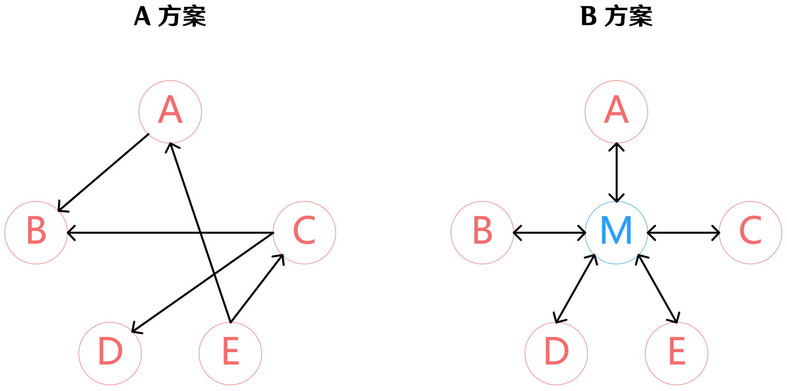

[上一篇](../Adapter%20Pattern/README.md)

---

# 中介者模式 Mediator

## 1、动机



* 在软件构建过程中，经常会出现多个对象互相关联交互的情况，对象之间常常会维持一种复杂的引用关系（如上图 A 方案），如果遇到一些需求的更改，这种直接的引用关系将面临不断的变化。

    > 比如 GUI 框架前端界面控件元素与后端数据模型对象的互相关联。前端修改界面元素时后端模型对象更新；同理后端修改模型对象时前端界面显示更新。

* 在这种情况下，我们可使用一个 “中介对象” 来管理对象间的关联关系（如上图 B 方案），避免相互交互的对象之间的紧耦合引用关系，从而更好地抵御变化。

    > 可以注意到中介者模式其实挺类似于[外观模式](../Facade%20Pattern/README.md)，都是添加一层新的中间层来隔离紧耦合。区别在于外观模式主要解决子系统内部与外部的紧耦合；而中介者主要解决系统内各个对象之间的紧耦合。

> 中介者模式是用来降低多个对象和类之间的通信复杂性。这种模式提供了一个中介类，该类通常处理不同类之间的通信，并支持松耦合，使代码易于维护。中介者模式属于行为型模式。

## 2、介绍

<dl>
    <dt>意图</dt>
    <dd>用一个中介对象来封装一系列的对象交互，中介者使各对象不需要显式地相互引用，从而使其耦合松散，而且可以独立地改变它们之间的交互。</dd>
    <dt>关键代码</dt>
    <dd>对象 Colleague 之间的通信封装到一个类中单独处理。</dd>
</dl>

---

## 3、实现

> 💬 中介者模式并没有特定的代码结构，甚至两段结构看起来千差万别的代码可能都表达的中介者模式。只要它们都体现了将系统内部多个对象解耦的思想。

我们通过一个聊天室示例来演示中介者模式。在示例中，多个用户可以向聊天室发送消息，聊天室向所有用户显示消息。在此示例中，聊天室 ChatRoom 将扮演中介类的角色。

### 步骤一

首先我们创建一个中介类 ChatRoom。其包含一个成员函数 `showMessage(User user, std::string message)` 用于显示指定用户发出的消息；其中 `user` 参数传递发出消息的用户，`message` 参数传递用户发出的消息。

我们的 ChatRoom 类如下：

```cpp
class ChatRoom
{

public:
	static inline void showMessage(User user, std::string message) {
		auto now = std::chrono::system_clock::now();
		std::time_t end_time = std::chrono::system_clock::to_time_t(now);
		char str[26];
		ctime_s(str, sizeof str, &end_time);
		std::string time_str(str);
		time_str.erase(std::remove(time_str.begin(), time_str.end(), '\n'), time_str.end());
		std::cout << time_str << " [" << user.getName() << "] : " << message << std::endl;
	}
};
```

> 这个函数看起来似乎还挺复杂，但其实最核心的代码只有函数内最后一行打印输出的代码。在此之前的所有代码都是在获取当前时间（[参考链接](https://stackoverflow.com/questions/997946/how-to-get-current-time-and-date-in-c "How to get current time and date in C++? - Stack Overflow")）。

### 步骤二

接下来我们创建用户类 User，其对象使用 ChatRoom 来分享他们的消息：

```cpp
class User
{

private:
	std::string name;

public:
	inline std::string getName() {
		return name;
	}
	inline void setName(std::string _name) {
		name = _name;
	}
	User(std::string _name) : name(_name) {}
	inline void sendMessage(std::string message) {
		ChatRoom::showMessage(*this, message);
	}
};
```

### 步骤三

在 `main()` 函数中，多个用户将互相聊天：

```cpp
int main() {
	User robert("Robert");
	User john("John");

	robert.sendMessage("Hi! John!");
	john.sendMessage("Hello! Robert!");
}
```

### 步骤四

执行程序，输出结果：

```plain
Thu Jan  4 09:14:57 2024 [Robert] : Hi! John!
Thu Jan  4 09:14:57 2024 [John] : Hello! Robert!
```

### 步骤五

[查看项目类图](https://learn.microsoft.com/zh-cn/visualstudio/ide/class-designer/designing-and-viewing-classes-and-types?view=vs-2022#add-class-diagrams-to-projects)

---

## 4、总结

* 将多个对象间复杂的关联关系解耦，中介者模式将多个对象间的控制逻辑进行集中管理，变 “多个对象互相关联” 为 “多个对象和一个中介者关联”。简化了系统的维护，抵御了可能的变化。
* 随着控制逻辑的复杂化，中介者具体对象的实现可能相当复杂。这时候可以对中介者对象进行分解处理。
* [外观模式](../Facade%20Pattern/README.md)是解耦系统间（单向）的对象关联关系；中介者模式是解耦系统内各个对象之间（双向）的关联关系。

---

[下一篇](../State%20Pattern/README.md)