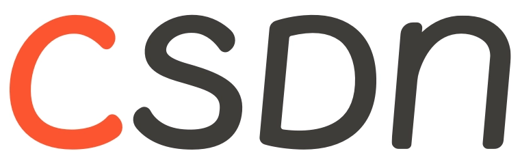

# 前言

在开始阅读 C++ 设计模式之前，您必须具备基本的 C++ 编程基础。我们将通过 C++ 实例，一步一步向您讲解「**设计模式**」的概念。

🔔 您可以参考笔者的《[面向对象程序设计(基础)](https://blog.csdn.net/ymgogre/category_12002686.html)》专栏了解 C++ 基础的相关内容。

    <h1 align="center">Design Patterns 设计模式</h1>

    
    
    
    
    
    
    

学习目标：

* 理解松耦合设计思想；
* 掌握面向对象设计原则；
* 掌握重构技法改善设计；
* 掌握 [GOF](https://zhuanlan.zhihu.com/p/265755169) 核心设计模式；

> **GOF**（Gang of Four，四人组）核心设计模式是由 Erich Gamma、Richard Helm、Ralph Johnson 和 John Vlissides 四位作者在他们的经典著作《[Design Patterns: Elements of Reusable Object-Oriented Software](https://item.jd.com/12623588.html)》中总结的 23 种设计模式。这些模式是面向对象软件设计中常见问题的典型解决方案，旨在提高代码的可复用性、可维护性、可读性、稳健性以及安全性。

这 23 种设计模式分为三类：

<dl>
    <dt>创建型模式（Creational Patterns）</dt>
    <dd>涉及对象创建机制，帮助创建对象的同时隐藏创建逻辑，增加了程序的灵活性。</dd>
    <dt>结构型模式（Structural Patterns）</dt>
    <dd>关注类和对象的组合，继承的概念被用来组合接口和定义组合对象获得新功能的方式。</dd>
    <dt>行为型模式（Behavioral Patterns）</dt>
    <dd>关注对象之间的通信，工作于对象和类的职责分配上，它们之间的对象协作。</dd>
</dl>

这些模式不仅仅是代码，更是一种思想，它们背后的设计原则包括开闭原则、里氏替换原则、依赖倒置原则等，这些原则指导着软件设计的方向，使得软件设计更加合理、灵活和可维护。

下表罗列了 23 种设计模式分别归属于哪一类：

<table>
    <tr>
        <th style="text-align:center;">名称</th>
        <th style="text-align:center;">英文名称</th>
        <th>简述</th>
    </tr>
    <tr>
        <td colspan="3" style="text-align:center; color:#E6A23C">💠 创建型模式（5 种）</td>
    </tr>
    <tr>
        <td style="text-align:center;"><a href="https://github.com/YMGogre/Cpp-Design-Patterns/tree/master/Singleton%20Pattern">单例模式</a></td>
        <td style="text-align:center;">Singleton</td>
        <td>确保一个类只有一个实例，并提供一个全局访问点。</td>
    </tr>
    <tr>
        <td style="text-align:center;"><a href="https://github.com/YMGogre/Cpp-Design-Patterns/tree/master/Prototype%20Pattern">原型模式</a></td>
        <td style="text-align:center;">Prototype</td>
        <td>通过复制现有的实例来创建新的实例，而不是新建实例。</td>
    </tr>
    <tr>
        <td style="text-align:center;"><a href="https://github.com/YMGogre/Cpp-Design-Patterns/tree/master/Factory%20Pattern">工厂模式</a></td>
        <td style="text-align:center;">Factory Method</td>
        <td>定义一个用于创建对象的接口，让子类决定实例化哪一个类。</td>
    </tr>
    <tr>
        <td style="text-align:center;"><a href="https://github.com/YMGogre/Cpp-Design-Patterns/tree/master/Abstract%20Factory%20Pattern">抽象工厂模式</a></td>
        <td style="text-align:center;">Abstract Factory</td>
        <td>创建一系列相关或相互依赖对象的接口，而无需指定它们具体的类。</td>
    </tr>
    <tr>
        <td style="text-align:center;"><a href="https://github.com/YMGogre/Cpp-Design-Patterns/tree/master/Builder%20Pattern">建造者模式</a></td>
        <td style="text-align:center;">Builder</td>
        <td>将一个复杂对象的构建与它的表示分离，使得同样的构建过程可以创建不同的表示。</td>
    </tr>
    <tr>
        <td colspan="3" style="text-align:center; color:#E6A23C">💠 结构型模式（7 种 + 1 种补充）</td>
    </tr>
    <tr>
        <td style="text-align:center;"><a href="https://github.com/YMGogre/Cpp-Design-Patterns/tree/master/Adapter%20Pattern">适配器模式</a></td>
        <td style="text-align:center;">Adapter</td>
        <td>允许将一个类的接口转换成客户期望的另一个接口。</td>
    </tr>
    <tr>
        <td style="text-align:center;"><a href="https://github.com/YMGogre/Cpp-Design-Patterns/tree/master/Bridge%20Pattern">桥接模式</a></td>
        <td style="text-align:center;">Bridge</td>
        <td>将抽象部分与实现部分分离，使它们可以独立变化。</td>
    </tr>
    <tr>
        <td style="text-align:center;"><a href="https://github.com/YMGogre/Cpp-Design-Patterns/tree/master/Filter%20Pattern">过滤器模式</a></td>
        <td style="text-align:center;">Filter</td>
        <td>允许开发人员使用不同的标准来过滤一组对象，通过逻辑运算以解耦的方式把它们连接起来。</td>
    </tr>
    <tr>
        <td style="text-align:center;"><a href="https://github.com/YMGogre/Cpp-Design-Patterns/tree/master/Composite%20Pattern">组合模式</a></td>
        <td style="text-align:center;">Composite</td>
        <td>将对象组合成树形结构以表示“部分-整体”的层次结构。</td>
    </tr>
    <tr>
        <td style="text-align:center;"><a href="https://github.com/YMGogre/Cpp-Design-Patterns/tree/master/Decorator%20Pattern">装饰模式</a></td>
        <td style="text-align:center;">Decorator</td>
        <td>动态地给一个对象添加一些额外的职责，就增加功能来说，装饰模式比生成子类更为灵活。 </td>
    </tr>
    <tr>
        <td style="text-align:center;"><a href="https://github.com/YMGogre/Cpp-Design-Patterns/tree/master/Facade%20Pattern">外观模式</a></td>
        <td style="text-align:center;">Facade</td>
        <td>为子系统中的一组接口提供一个一致的界面，定义一个高层接口，这个接口使得这一子系统更加容易使用。</td>
    </tr>
    <tr>
        <td style="text-align:center;"><a href="https://github.com/YMGogre/Cpp-Design-Patterns/tree/master/Flyweight%20Pattern">享元模式</a></td>
        <td style="text-align:center;">Flyweight</td>
        <td>运用共享技术有效地支持大量细粒度的对象。</td>
    </tr>
    <tr>
        <td style="text-align:center;"><a href="https://github.com/YMGogre/Cpp-Design-Patterns/tree/master/Proxy%20Pattern">代理模式</a></td>
        <td style="text-align:center;">Proxy</td>
        <td>为其他对象提供一种代理以控制对这个对象的访问。</td>
    </tr>
    <tr>
        <td colspan="3" style="text-align:center; color:#E6A23C">💠 行为型模式（11 种 + 1 种补充）</td>
    </tr>
    <tr>
        <td style="text-align:center;"><a href="https://github.com/YMGogre/Cpp-Design-Patterns/tree/master/Template%20Pattern">模板方法模式</a></td>
        <td style="text-align:center;">Template Method</td>
        <td>定义一个操作中的算法的骨架，而将一些步骤延迟到子类中。 </td>
    </tr>
    <tr>
        <td style="text-align:center;"><a href="https://github.com/YMGogre/Cpp-Design-Patterns/tree/master/Command%20Pattern">命令模式</a></td>
        <td style="text-align:center;">Command</td>
        <td>将一个请求封装为一个对象，从而使你可用不同的请求对客户进行参数化。</td>
    </tr>
    <tr>
        <td style="text-align:center;"><a href="https://github.com/YMGogre/Cpp-Design-Patterns/tree/master/Iterator%20Pattern">迭代器模式</a></td>
        <td style="text-align:center;">Iterator</td>
        <td>提供一种方法顺序访问一个聚合对象中各个元素，而又不暴露该对象的内部表示。</td>
    </tr>
    <tr>
        <td style="text-align:center;"><a href="https://github.com/YMGogre/Cpp-Design-Patterns/tree/master/Observer%20Pattern">观察者模式</a></td>
        <td style="text-align:center;">Observer</td>
        <td>定义对象间的一种一对多的依赖关系，当一个对象的状态发生改变时，所有依赖于它的对象都得到通知并被自动更新。</td>
    </tr>
    <tr>
        <td style="text-align:center;"><a href="https://github.com/YMGogre/Cpp-Design-Patterns/tree/master/Mediator%20Pattern">中介者模式</a></td>
        <td style="text-align:center;">Mediator</td>
        <td>用一个中介对象来封装一系列的对象交互，中介者使各对象不需要显示地相互引用，从而使其耦合松散，而且可以独立地改变它们之间的交互。</td>
    </tr>
    <tr>
        <td style="text-align:center;"><a href="https://github.com/YMGogre/Cpp-Design-Patterns/tree/master/Memento%20Pattern">备忘录模式</a></td>
        <td style="text-align:center;">Memento</td>
        <td>在不破坏封装的前提下，捕获一个对象的内部状态，并在该对象之外保存这个状态。</td>
    </tr>
    <tr>
        <td style="text-align:center;"><a href="https://github.com/YMGogre/Cpp-Design-Patterns/tree/master/Interpreter%20Pattern">解释器模式</a></td>
        <td style="text-align:center;">Interpreter</td>
        <td>给定一个语言，定义它的文法的一种表示，并定义一个解释器，这个解释器使用该表示来解释语言中的句子。</td>
    </tr>
    <tr>
        <td style="text-align:center;"><a href="https://github.com/YMGogre/Cpp-Design-Patterns/tree/master/State%20Pattern">状态模式</a></td>
        <td style="text-align:center;">State</td>
        <td>允许一个对象在其内部状态改变时改变它的行为，对象看起来好像修改了它的类。</td>
    </tr>
    <tr>
        <td style="text-align:center;"><a href="https://github.com/YMGogre/Cpp-Design-Patterns/tree/master/Null%20Object%20Pattern">空对象模式</a></td>
        <td style="text-align:center;">Null Object</td>
        <td>一个空对象取代 NULL 对象实例的检查。空对象不是用来检查空值，而是反映一个不做任何动作的关系。</td>
    </tr>
    <tr>
        <td style="text-align:center;"><a href="https://github.com/YMGogre/Cpp-Design-Patterns/tree/master/Strategy%20Pattern">策略模式</a></td>
        <td style="text-align:center;">Strategy</td>
        <td>定义一系列的算法，把它们一个个封装起来，并且使它们可相互替换。</td>
    </tr>
    <tr>
        <td style="text-align:center;"><a href="https://github.com/YMGogre/Cpp-Design-Patterns/tree/master/Chain%20of%20Responsibility%20Pattern">责任链模式</a></td>
        <td style="text-align:center;">Chain of Responsibility</td>
        <td>为解除请求的发送者和接收者之间耦合，而使多个对象都有机会处理这个请求。</td>
    </tr>
    <tr>
        <td style="text-align:center;"><a href="https://github.com/YMGogre/Cpp-Design-Patterns/tree/master/Visitor%20Pattern">访问者模式</a></td>
        <td style="text-align:center;">Visitor</td>
        <td>表示一个作用于某对象结构中的各元素的操作，它使你可以在不改变各元素的类的前提下定义作用于这些元素的新操作。</td>
    </tr>
</table>

# 从面向对象谈起

以上提到的设计模式主要是针对面向对象的设计模式。所以我们首先从面向对象谈起：

那么谈到面向对象，其所蕴含的两层思维模型可以表示为如下：

* 底层思维：向下，如何把握机器底层从微观理解对象构造。
    * 语言构造
    * 编译转换
    * 内存模型
    * 运行时机制
* 抽象思维：向上，如何将我们的周围世界抽象为程序代码。
    * 面向对象
    * 组件封装
    * 设计模式
    * 架构模式

为了更好地学习设计模式，我们需要深入理解面向对象。这就需要我们：

* 向下：深入理解三大面向对象机制。
    * **封装**，隐藏内部实现
    * **继承**，复用现有代码
    * **多态**，改写对象行为

* 向上：深刻把握面向对象机制所带来的抽象意义，理解如何使用这些机制来表达现实世界。掌握什么是“好的面向对象设计”。

# Q&A

## Q：什么是设计模式？

**A**：

“每一个模式描述了一个在我们周围不断重复发生的问题，以及该问题的解决方案的核心。这样，你就能一次又一次地使用该方案而不必做重复劳动。”

—— Christopher Alexander

## Q：C++ 和设计模式有什么关联呢？

**A**：

本仓库是设计模式的 C++ 实现。但需要注意，设计模式并不和某一个特定的编程语言直接相关。它们是一套解决特定类型问题的通用模板，可以在任何面向对象的编程语言中实现。设计模式的核心在于提供一种组织代码的方法，以便于代码重用、维护和扩展。

所以，无论是 C++ 设计模式、Java 设计模式还是 C# 设计模式等等，它们本质上都是在讨论相同的概念。

## Q：人类通常如何解决复杂问题？

**A**：

<dl>
    <dt>分解</dt>
    <dd>人们面对复杂性有一个常见的做法：即分而治之，将大问题分解为多个小问题，将复杂问题分解为多个简单问题。</dd>
    <dt>抽象</dt>
    <dd>更高层次来讲，人们处理复杂性有一个通用的技术，即抽象。由于不能掌握全部的复杂对象，我们选择忽视它的非本质细节，而去处理泛化和理想化了的对象模型。</dd>
</dl>

> 在后续的学习中我们会不断深刻理解到：“**抽象**”这一解决问题的思想将会大放异彩。并基于这样一种“抽象”设计思想针对不同领域的不同问题提出不同的设计模式。

# 参考资料

1. [C++ 设计模式入门](https://www.bilibili.com/video/BV1Yr4y157Ci/ "C++设计模式入门_哔哩哔哩_bilibili")
2. [《大话设计模式 - 程杰◎著》](https://search.jd.com/Search?keyword=%E5%A4%A7%E8%AF%9D%E8%AE%BE%E8%AE%A1%E6%A8%A1%E5%BC%8F "大话设计模式 - 商品搜索 - 京东")
3. [设计模式 | 菜鸟教程](https://www.runoob.com/design-pattern/design-pattern-tutorial.html "设计模式 | 菜鸟教程")

---

[下一篇](./面向对象设计原则/面向对象设计原则.md)