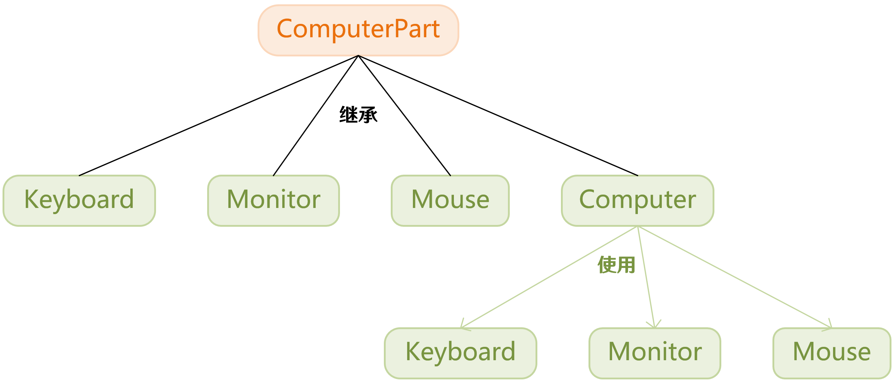

[上一篇](../Command%20Pattern/README.md)

---

# 访问者模式 Visitor

## 1、动机

* 在软件构建过程中，由于需求的改变，某些类层次结构中常常需要增加新的行为（方法）。如果直接在基类中做这样的更改，将会给子类带来很繁重的变更负担，甚至破坏原有设计。
* 如何在不更改类层次结构的前提下，在运行时根据需要透明地为类层次结构上的各个类动态添加新的操作，从而避免上述问题？

> 在访问者模式中，我们使用了一个访问者类，它改变了元素类（类层次结构中的单个类即 *元素类*）的执行算法。通过这种方式，元素的执行算法可以随着访问者改变而改变。这种类型的设计模式属于行为型模式。根据模式，元素对象已接受访问者对象，这样访问者对象就可以处理元素对象上的操作。

## 2、介绍

<dl>
    <dt>意图</dt>
    <dd>表示一个作用于某对象结构中的各元素的操作。使得可以在不改变各元素的类的前提下定义作用于这些元素的新操作。主要将数据结构与数据操作分离。</dd>
    <dt>关键代码</dt>
    <dd>在数据基础类里面有一个方法接受访问者，将自身引用传入访问者。</dd>
</dl>

---

## 3、实现

### 步骤一

我们将创建一个表示元素的接口 ComputerPart：

```cpp
class ComputerPart
{

public:
	virtual void accept(ComputerPartVisitor& computerPartVisitor) = 0;
	virtual ~ComputerPart() {}
};
```

> 我们现在先不关注 `accept(ComputerPartVisitor& computerPartVisitor)` 是个什么函数；先将注意力集中到类的层次结构上。

### 步骤二

接下来我们创建实现了 ComputerPart 类的实体类 Keyboard（键盘）、Monitor（显示器）、Mouse（鼠标）、Computer（电脑）以搭建一个类的层次结构：

```cpp
class Keyboard :
	public ComputerPart
{

public:
	inline virtual void accept(ComputerPartVisitor& computerPartVisitor) override {
		computerPartVisitor.visit(*this);
	}
};
```

```cpp
class Monitor :
	public ComputerPart
{

public:
	inline virtual void accept(ComputerPartVisitor& computerPartVisitor) override {
		computerPartVisitor.visit(*this);
	}
};
```

```cpp
class Mouse :
	public ComputerPart
{

public:
	inline virtual void accept(ComputerPartVisitor& computerPartVisitor) override {
		computerPartVisitor.visit(*this);
	}
};
```

```cpp
class Computer :
	public ComputerPart
{

private:
	ComputerPart* parts[3];

public:
	Computer() : parts{new Mouse(), new Keyboard(), new Monitor()} {}
	inline virtual void accept(ComputerPartVisitor& computerPartVisitor) override {
		auto length = sizeof(parts) / sizeof(parts[0]);
		for (int i = 0; i < length; i++) {
			parts[i]->accept(computerPartVisitor);
		}
		computerPartVisitor.visit(*this);
	}
	virtual ~Computer() {
		for (auto& part : parts) {
			delete part;
		}
	}
};
```

> 到目前为止我们已经建立起了如下图所示的类的层次结构：<br>

### 步骤三

现在假设我想要在原有的类的层次结构上添加新功能 —— 在终端打印自己是什么部件。按照常规思路，我们可能需要在 ComputerPart 类中新增一个纯虚函数（假设是 `print()` 函数），随后所有派生类实现 `print()` 函数。😕

感觉还挺麻烦，要改的东西挺多，也没有满足开闭原则。

> 我们预料到了未来可能会发生这样的事儿（为整个类层次结构添加新的操作），但是现在我们还不知道具体要加什么操作，要加多少操作。所以我们在 ComputerPart 类中添加了一个 `accept(ComputerPartVisitor& computerPartVisitor)` 纯虚成员函数。
>
> 该方法的参数需要传递一个 ComputerPartVisitor 对象引用。ComputerPartVisitor 是访问者抽象类，其内部针对 ComputerPart 的每一个子类声明了一个纯虚函数。

我们的 ComputerPartVisitor 访问者抽象类如下：

```cpp
class ComputerPartVisitor
{

public:
	virtual void visit(Keyboard& keyboard) = 0;
	virtual void visit(Monitor& monitor) = 0;
	virtual void visit(Mouse& mouse) = 0;
	virtual void visit(Computer& computer) = 0;
	virtual ~ComputerPartVisitor() {}
};
```

> 在 ComputerPart 的派生类中，我们需要实现抽象类的 `accept(ComputerPartVisitor& computerPartVisitor)` 方法，将自身引用传入访问者。就像[步骤二](#步骤二)当中做的那样。

### 步骤四

接下来我们再次尝试在原有的类的层次结构上添加新功能 —— 在终端打印自己是什么部件。

不过这一次，我们将通过新创建一个访问者类 ComputerPartDisplayVisitor 来实现：

```cpp
class ComputerPartDisplayVisitor :
	public ComputerPartVisitor
{

public:
	inline virtual void visit(Keyboard& keyboard) override {
		std::cout << "Displaying Keyboard." << std::endl;
	}
	inline virtual void visit(Monitor& monitor) override {
		std::cout << "Displaying Monitor." << std::endl;
	}
	inline virtual void visit(Mouse& mouse) override {
		std::cout << "Displaying Mouse." << std::endl;
	}
	inline virtual void visit(Computer& computer) override {
		std::cout << "Displaying Computer." << std::endl;
	}
};
```

> 在未来，如果还想要新增别的功能，创建新的访问者类就好啦，不需要改动原有代码。

### 步骤五

在 `main()` 函数中，Computer 对象接受一个访问者对象来显示一台电脑的组成部分：

```cpp
int main() {
	ComputerPart* computer = new Computer();
	ComputerPartDisplayVisitor visitor;
	computer->accept(visitor);
	delete computer;
}
```

### 步骤六

执行程序，输出结果：

```plain
Displaying Mouse.
Displaying Keyboard.
Displaying Monitor.
Displaying Computer.
```

### 步骤七

[查看项目类图](https://learn.microsoft.com/zh-cn/visualstudio/ide/class-designer/designing-and-viewing-classes-and-types?view=vs-2022#add-class-diagrams-to-projects)

---

## 4、总结

* 访问者模式一个比较大的缺点是我们在创建访问者接口（本例中的 ComputerPartVisitor）时，原有的类的层次结构必须要清晰（本例中的 ComputerPart、Keyboard、Monitor、Mouse 以及 Computer）。也就是原有的类层次结构得要求是稳定的，然而这往往很难保证；这导致了访问者模式难以应对具体元素的变更。
* 访问者模式通过所谓的双重分发（double dispatch）来实现在不更改（不添加新的操作-编译时）元素类层次结构的前提下，在运行时透明地为类层次结构上的各个类动态添加新的操作（支持变化）。
* 所谓双重分发即访问者模式中间包括了两个多态分发（注意其中的多态机制）：第一个为 `accept()` 方法的多态辨析；第二个为 `visit()` 方法的多态辨析。
* 访问者模式的最大缺点在于扩展类层次结构（添加新的元素子类），会导致访问者类的改变。因此访问者模式适用于 “元素类层次结构稳定，而其中的操作却经常面临频繁改动”。

---

[下一篇](../Interpreter%20Pattern/README.md)