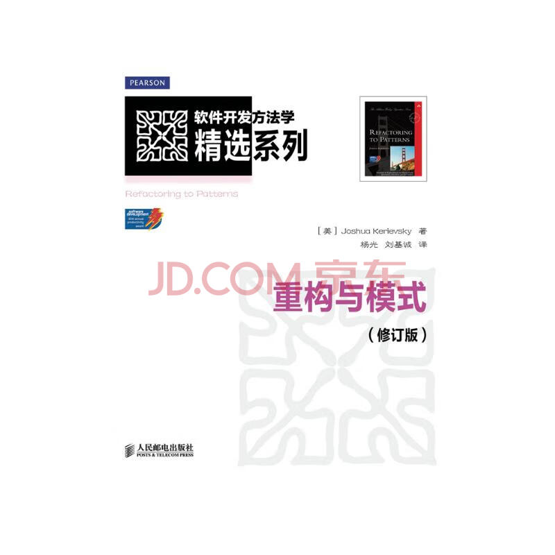

[上一篇](../面向对象设计原则/面向对象设计原则.md)

---

# 从封装变化角度对设计模式分类

在[开篇](../README.md)我们讨论了 GOF 在他们的经典著作中将设计模式分为了三类：
* **创建型模式（Creational Patterns）**；
* **结构型模式（Structural Patterns）**；
* **行为型模式（Behavioral Patterns）**。

除了原作者的分类方式外，接下来我们将从封装变化的角度对设计模式进行分类，也许能帮助大家更好地理解设计模式：

<dl>
    <dt>💠 组件协作</dt>
    <dd><ul><li>模板方法模式 Template Method</li><li>策略模式 Strategy</li><li>观察者模式 Observer / Event</li></ul></dd>
    <dt>💠 单一职责</dt>
    <dd><ul><li>装饰模式 Decorator</li><li>桥接模式 Bridge</li></ul></dd>
    <dt>💠 对象创建</dt>
    <dd><ul><li>工厂模式 Factory Method</li><li>抽象工厂模式 Abstract Factory</li><li>原型模式 Prototype</li><li>建造者模式 Builder</li></ul></dd>
    <dt>💠 对象性能</dt>
    <dd><ul><li>单例模式 Singleton</li><li>享元模式 Flyweight</li></ul></dd>
    <dt>💠 接口隔离</dt>
    <dd><ul><li>外观模式 Facade</li><li>代理模式 Proxy</li><li>中介者模式 Mediator</li><li>适配器模式 Adapter</li></ul></dd>
    <dt>💠 状态变化</dt>
    <dd><ul><li>备忘录模式 Memento</li><li>状态模式 State</li></ul></dd>
    <dt>💠 数据结构</dt>
    <dd><ul><li>组合模式 Composite</li><li>迭代器模式 Iterator</li><li>责任链模式 Chain of Responsibility</li></ul></dd>
    <dt>💠 行为变化</dt>
    <dd><ul><li>命令模式 Command</li><li>访问者模式 Visitor</li></ul></dd>
    <dt>💠 领域问题</dt>
    <dd><ul><li>解释器模式 Interpreter</li></ul></dd>
</dl>

# 重构获得模式 Refactoring to Patterns

* 面向对象设计模式是 **“好的面向对象设计”**，所谓 “好的面向对象设计” 指的是那些可以满足 “应对变化，提高复用” 的设计。
* 现代软件设计的特征是 “需求的频繁变化”。设计模式的要点是 “**寻找变化点，然后在变化点处应用设计模式，从而来更好地应对需求的变化**”。“什么时候，什么地点应用设计模式” 比 “理解设计模式结构本身” 更为重要。
* 设计模式的应用不宜先入为主，一上来就使用设计模式是对设计模式的最大误用。没有一步到位的设计模式。敏捷软件开发实践提倡的 “**Refactoring to Patterns**” 是目前普遍公认的最佳使用设计模式的方法。

## 推荐书目

* 《[重构 改善既有代码的设计](https://search.jd.com/Search?keyword=%E9%87%8D%E6%9E%84.%E6%94%B9%E5%96%84%E6%97%A2%E6%9C%89%E4%BB%A3%E7%A0%81%E7%9A%84%E8%AE%BE%E8%AE%A1)》(2nd Ed.), Martin Fowler 
* 《[重构与模式](https://search.jd.com/Search?keyword=%E9%87%8D%E6%9E%84%E4%B8%8E%E6%A8%A1%E5%BC%8F)》(Rev.), Joshua Kerievsky 

## 重构关键技法

* 静态 → 动态
* 早绑定 → 晚绑定
* 继承 → 组合
* 编译时依赖 → 运行时依赖
* 紧耦合 → 松耦合

---

# “组件协作”模式

现代软件专业分工之后的第一个结果是 “框架与应用程序的划分”，“组件协作” 模式通过**晚期绑定**，来实现框架与应用程序之间的**松耦合**，是二者之间协作时常用的模式。

典型模式：
* 模板方法模式 Template Method
* 策略模式 Strategy
* 观察者模式 Observer / Event

---

[下一篇](../Template%20Pattern/README.md)